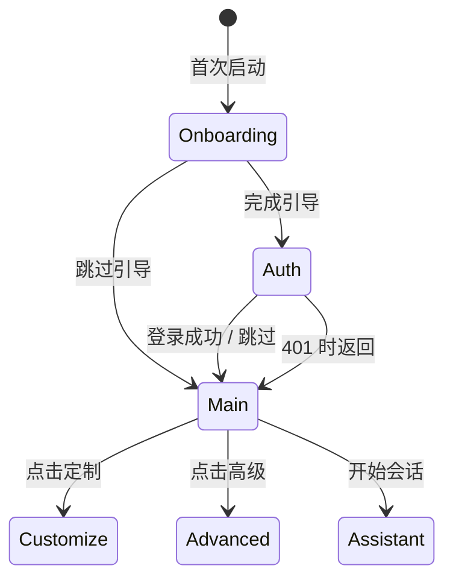
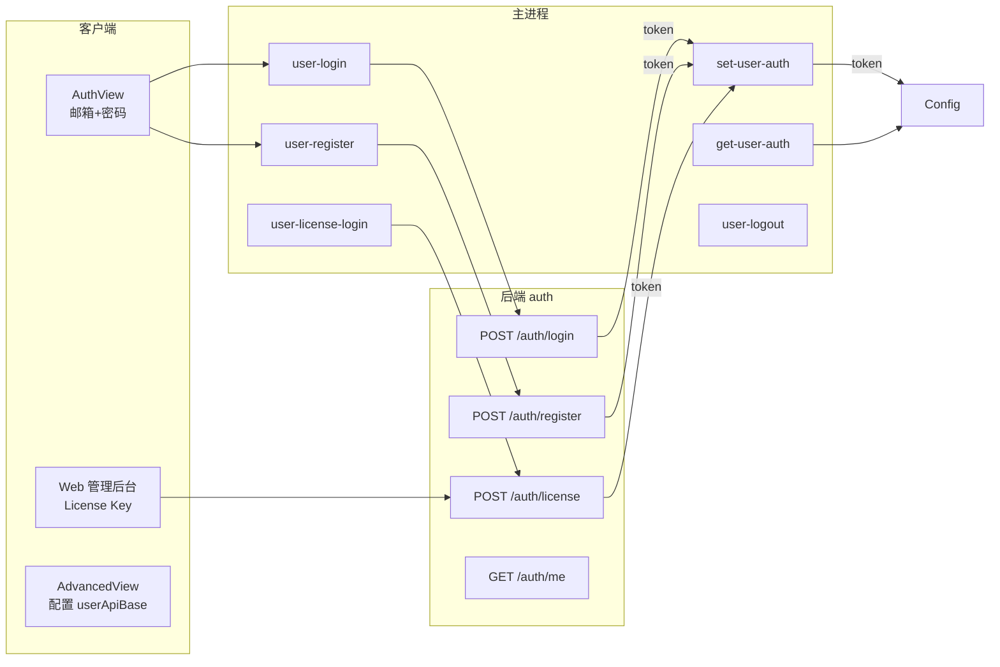
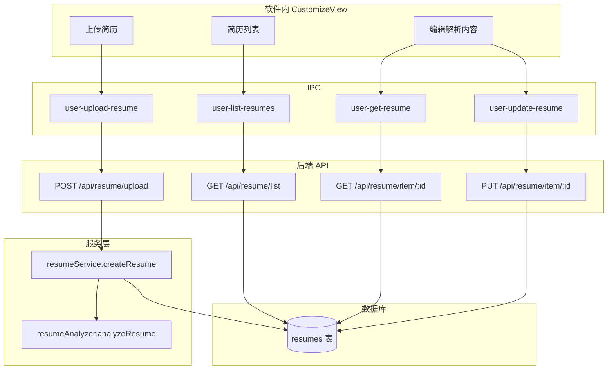
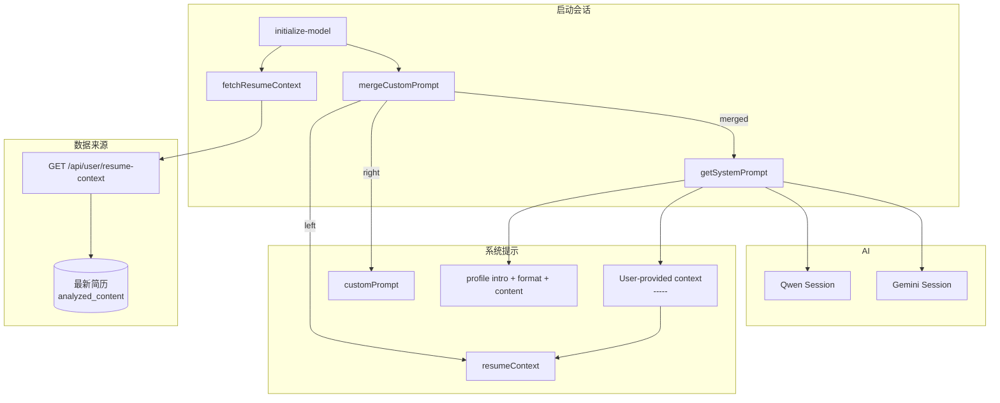
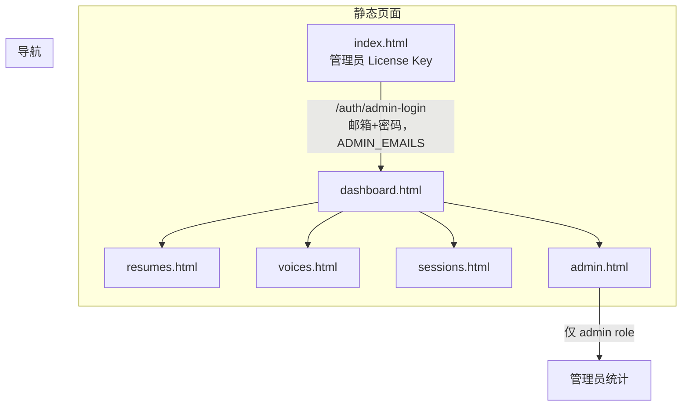
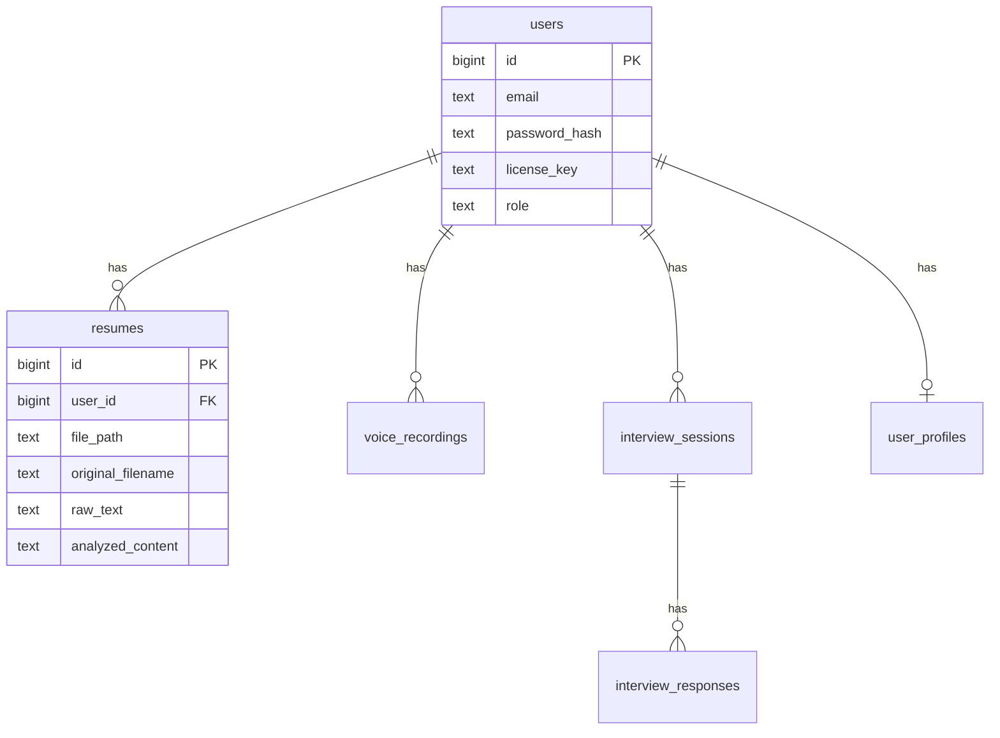

# 作弊老铁 - 系统逻辑结构图

> 生成时间：2026-03-03

---

## 1. 整体架构

```mermaid
flowchart TB
    subgraph Electron["🖥️ Electron 桌面应用"]
        direction TB
        App[CheatingDaddyApp]
        App --> Onboarding[OnboardingView<br/>首次引导]
        App --> Auth[AuthView<br/>登录/注册]
        App --> Main[MainView<br/>主界面]
        App --> Customize[CustomizeView<br/>定制/简历管理]
        App --> Advanced[AdvancedView<br/>高级设置]
        App --> Assistant[AssistantView<br/>AI 对话]
        App --> History[HistoryView]
        App --> Help[HelpView]
    end

    subgraph MainProcess["⚙️ 主进程 (src/index.js)"]
        IPC[IPC Handlers]
        Config[本地配置]
        Session[AI Session<br/>Qwen/Gemini]
    end

    subgraph Backend["🔧 user-management 后端"]
        API[Express API]
        API --> AuthAPI[/auth]
        API --> ResumeAPI[/api/resume]
        API --> UserAPI[/api/user]
        API --> VoiceAPI[/api/voice]
        API --> SessionsAPI[/api/sessions]
        API --> AdminAPI[/api/admin]
    end

    subgraph DB[(PostgreSQL)]
        Users[users]
        Resumes[resumes]
        Voices[voice_recordings]
        Sessions[interview_sessions]
    end

    Electron <-->|IPC| MainProcess
    MainProcess <-->|HTTP| Backend
    Backend <--> DB
```

---

## 2. 应用入口流程



---

## 3. 认证与用户流程



**当前状态**：
- 软件内：使用 `/auth/license` 登录（所有人共用同一 License Key）
- Web 管理后台：使用 `/auth/admin-login`（邮箱 + 密码），仅 `ADMIN_EMAILS` 中配置的邮箱可注册/登录，且需 role=admin

---

## 4. 简历管理流程



**简历解析**：上传 → 提取文本(PDF/DOCX) → 大模型分析 → 存入 `analyzed_content` → 可编辑

---

## 5. 面试会话与简历上下文注入



**关键**：`analyzed_content` 作为「用户提供的上下文」注入面试 AI 的系统提示，用于面试辅导、模拟面试。

---

## 6. Web 管理门户结构（仅管理员）



**说明**：软件内不展示 Web 管理后台入口，用户所有操作在软件内完成。Web 端仅管理员通过配置的 License Key 登录。

---

## 7. 数据库表关系（简要）



---

## 8. 关键 IPC 一览

| IPC | 用途 |
|-----|------|
| `get-user-auth` | 获取当前登录状态 |
| `set-user-auth` | 设置 token / userApiBase |
| `user-login` / `user-register` / `user-license-login` | 认证 |
| `user-upload-resume` | 上传并解析简历 |
| `user-list-resumes` | 简历列表 |
| `user-get-resume` | 获取单份简历详情 |
| `user-update-resume` | 更新解析内容 |
| `initialize-model` | 初始化 AI 会话（含简历上下文） |
| `send-text-message` / `send-image-content` | 发送消息给 AI |
| `commit-transcript-segment` | 提交转写片段 |

---

## 9. 配置存储

```mermaid
flowchart LR
    subgraph 主进程
        C[getLocalConfig]
    end

    subgraph 存储
        F[config.json<br/>或 内存]
    end

    C --> F

    F --> |userApiBase| 后端地址
    F --> |userAuthToken| JWT
    F --> |apiKey| 模型 Key
    F --> |modelApiBase| 模型 API 地址
```
